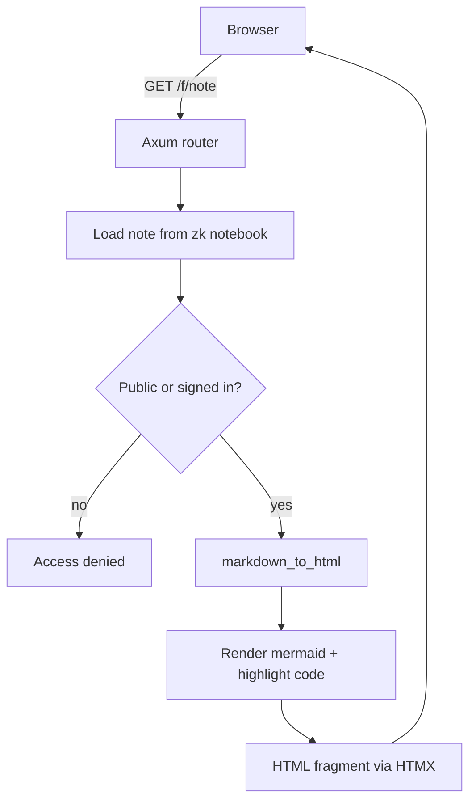
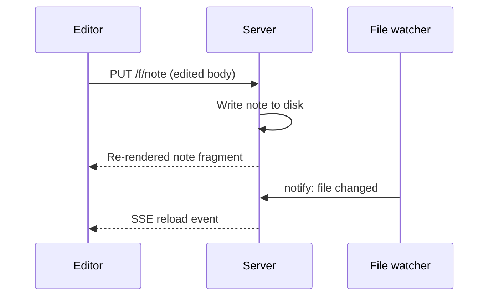

# Markdown

Weave renders [CommonMark](https://commonmark.org/) with a handful of GitHub
Flavored Markdown extensions and a few zk-specific niceties. This page
demonstrates every supported feature so you can copy the patterns into your own
notes.

## Headings

Use `#` through `######` for headings. Each heading gets a URL-safe anchor so
you can deep-link to a section, like [the lists section](#lists).

### Third level

#### Fourth level

##### Fifth level

###### Sixth level

## Inline formatting

You can write **bold**, *italic*, ***bold italic*** and ~~strikethrough~~
inline. Inline `code spans` use backticks. Smart punctuation turns "straight"
quotes into curly ones and `--` into en dashes automatically.

A line ending with two trailing spaces  
forces a hard line break.

## Lists

Unordered lists use `-` or `*`:

- First item
- Second item
  - Nested item
  - Another nested item
    - Even deeper
- Third item

Ordered lists use numbers:

1. Build the binary
2. Point it at a notebook
3. Open the browser

## Blockquotes

> A regular blockquote is rendered with a thin accent bar and slightly muted
> italic text. Useful for citing other notes or external sources.

## Admonitions

Admonitions reuse the GitHub Flavored Markdown alert syntax. Five kinds are
recognised:

> [!NOTE]
> Use a note to highlight information that a reader should know, even when
> skimming.

> [!TIP]
> Tips suggest a better or faster way to accomplish a task.

> [!IMPORTANT]
> Important admonitions call out crucial information needed to succeed.

> [!WARNING]
> Warnings flag content that requires immediate attention to avoid problems.

> [!CAUTION]
> Cautions describe negative outcomes of an action.

## Code

Fenced code blocks support syntax highlighting when a language is provided.

```rust
fn greet(name: &str) -> String {
    format!("Hello, {name}!")
}

fn main() {
    println!("{}", greet("Weave"));
}
```

```bash
ZK_NOTEBOOK_DIR="$(pwd)/notebook" cargo run --release
```

```python
def fib(n: int) -> int:
    a, b = 0, 1
    for _ in range(n):
        a, b = b, a + b
    return a
```

Code blocks without a language are rendered verbatim, without highlighting:

```text
plain monospace text
```

## Diagrams

Fenced blocks tagged `mermaid` are rendered to SVG on the server, so diagrams
work without any client-side JavaScript. The example below sketches what happens
when you open a note in weave:



Sequence diagrams work too, here showing a save round-trip from the editor:



## Math

Write inline math between single dollar signs and display math between double
dollars.

The transfer function is $H(s) = \frac{1}{1 + sRC}$.

$$
X(f) = \int_{-\infty}^{\infty} x(t)\, e^{-j 2 \pi f t}\, dt
$$

Dollar signs inside code blocks and inline `code spans` are left untouched:
`$x$`.

A lone `$` used for currency is only treated as math when it can close a
formula, so `costs $5 to $10` stays plain text. Use `\$` or a code span to force
a literal dollar sign next to math.

## Tables

| Variable             | Description                              | Default      |
| -------------------- | ---------------------------------------- | ------------ |
| `ZK_NOTEBOOK_DIR`    | Path to the notebook directory           | (required)   |
| `WEAVE_PASSWORD`     | Password for signing in                  | (empty)      |
| `WEAVE_PORT`         | Port the server listens on               | `8000`       |
| `WEAVE_HOST`         | IP address the server listens on         | `127.0.0.1`  |

## Links

External links open the target URL and are marked with a small arrow icon, like
[the zk project page](https://github.com/zk-org/zk). Bare URLs are auto-linked
too: <https://example.com>.

Reference-style links work as well, e.g. [the zk tags docs][tags].

Internal links to other notes use the destination note's filename stem:

- [Weave overview](weave)
- [Installation guide](installation)
- [Usage tips](usage)

Relative paths such as `./usage` or `../usage` are accepted and resolve to the
same note.

## Tags

Zk uses [tags][] to group and find notes of a related topic. Two inline styles
are recognised and turned into clickable filters:

- Hashtags like #example or #public open the sidebar filtered to that tag.
- Colon tags borrow the zk convention: :draft:review: behaves the same way for
  each segment.

Tags can also be listed in the YAML frontmatter (`tags: [public, pin]`) instead
of inline in the note body.

## Images and attachments

Images use the standard `` syntax, and any other file in the
attachments directory can be linked with `[text](path)`. Relative paths are made
root-absolute so they resolve regardless of the current note URL, which is
particularly useful together with the `WEAVE_ATTACHMENTS` directory. Start the
demo notebook with `WEAVE_ATTACHMENTS=media` to serve the files below. See the
[usage section](usage) for how to configure it.


[Link to the weave logo file](media/weave.svg)

## Horizontal rules

Three or more dashes on their own line produce a horizontal rule:

---

Useful for separating loosely related sections inside a single note.

[tags]: https://zk-org.github.io/zk/notes/tags.html

#public
